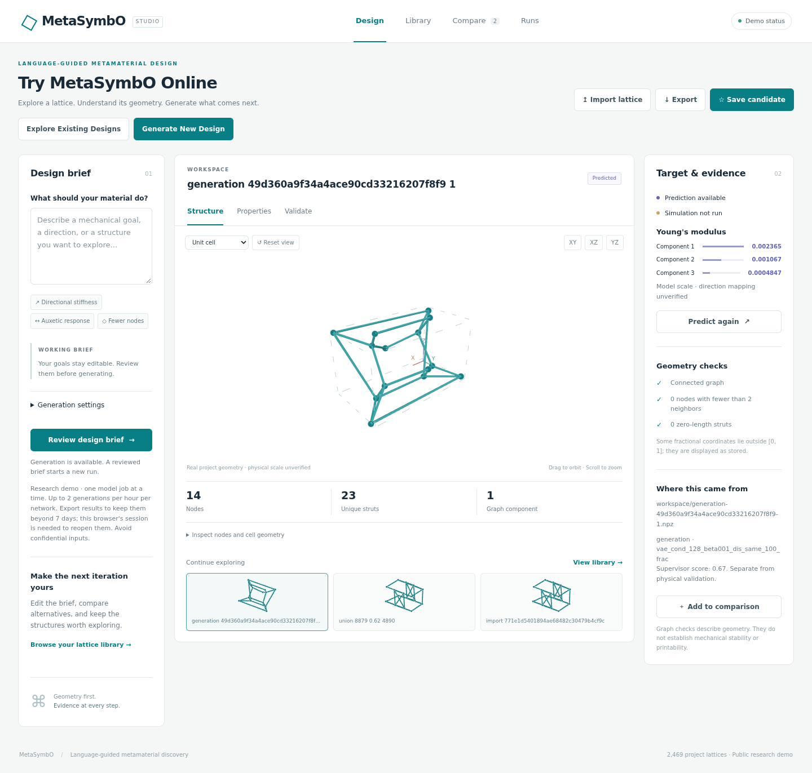

# MetaSymbO

**Multi-Agent Language-Guided Metamaterial Discovery via Symbolic Latent Evolution**

Check out our introduction Video: https://drive.google.com/file/d/1Q5i45GsMDzTKgBZYi4eyKrio8zwlreMi/view?usp=sharing

MetaSymbO turns natural-language design goals into three-dimensional metamaterial lattices. A language-based designer, a learned generator, and a supervisor collaborate through symbolic operations and latent-space optimization to explore candidate structures and their predicted elastic properties.

We appreciate the citations as follows:
~~~
@inproceedings{
chen2026metasymbo,
title={MetaSymbO: Multi-Agent Language-Guided Metamaterial Discovery via Symbolic Latent Evolution},
author={Jianpeng Chen and Wangzhi Zhan and Dongqi Fu and Junkai Zhang and Zian Jia and Ling Li and Wei Wang and Dawei Zhou},
booktitle={Third Conference on Language Modeling},
year={2026},
url={https://openreview.net/forum?id=XccQjdb8wh}
}
~~~

## Try MetaSymbO Online

### [Open the live Design Studio →](http://zhoulab-1.cs.vt.edu:5559/)

Explore existing designs or generate a new lattice directly in your browser. **No installation, SSH tunnel, account, or personal API key is required.**

[](http://zhoulab-1.cs.vt.edu:5559/)

*An actual generated candidate in the live interface. Predictions and supervisor feedback are labeled separately from physical simulation.*

| Workflow | What you can do |
| --- | --- |
| **Explore** | Browse and search saved lattices; rotate, zoom, inspect nodes, and repeat unit cells in 3D. |
| **Generate** | Describe a mechanical design goal, review the brief, and follow the asynchronous generation process. |
| **Predict** | Run the local property predictor and inspect Young's modulus, shear modulus, and Poisson-ratio components. |
| **Compare** | Inspect up to four candidates with synchronized cameras, consistent display scales, and geometry/property tables. |
| **Review evidence** | Examine connectivity checks, supervisor scores, suggested refinements, and recorded generation settings. |
| **Keep results** | Reopen completed runs; import NPZ lattices and export geometry, CSV tables, viewport images, and JSON reports. |

**Start here:** open the demo → choose **Explore Existing Designs** or **Generate New Design** → inspect the structure and its evidence → compare or export your results.

Example brief:

> Design a simple connected lattice that is stiffer along Z than X and Y, with fewer than 20 nodes.

The shared demo runs one model job at a time. Generation is limited to two requests per hour per IP, with bounded attempts and runtime. Public runs belong to your browser session; export important results before the seven-day cleanup window. The service currently uses **HTTP**, so avoid confidential inputs.

**[Interface guide](WebInterface/README.md)** · **[Deployment and operations](deploy/README.md)** · **[Service health](http://zhoulab-1.cs.vt.edu:5559/api/health)**

## How it works

1. **Designer agent** translates the design brief into a structural scaffold.
2. **Generator model** uses the VAE, symbolic latent operations, and optimization to construct candidate lattices.
3. **Supervisor agent** evaluates candidates using predicted elastic properties and proposes refinements.
4. **Design Studio** exposes the geometry, predictions, feedback, progress, and saved results for human review.

Supported symbolic operations are `union`, `mix`, `int`, and `neg`. They operate in the learned representation and do not guarantee exact geometric Boolean operations or satisfaction of every requested constraint.

## Run the interface locally

The deployed application is tested with **Python 3.11** in the project's `mat_env` environment. Model execution requires the project's PyTorch/PyTorch Geometric stack and compatible checkpoints. Browsing additionally uses FastAPI, Uvicorn, NumPy, and Plotly; there is no frontend build step or CDN dependency.

```bash
git clone https://github.com/cjpcool/MetaSymbO.git
cd MetaSymbO
conda activate mat_env
python -m WebInterface.app --port 18766
```

Open [http://127.0.0.1:18766](http://127.0.0.1:18766). This command assumes the existing model environment is installed; cloning the repository does not download the dataset or model weights. Port 18765 is reserved for the deployed backend on zhoulab-1.

For generation, configure `OPENAI_API_KEY` in a server-side environment variable or the Git-ignored root `.env`, and restrict the file to its owner:

```bash
chmod 600 .env
```

The server reads the key without executing the file. Credentials never reach browser JavaScript. Prediction does not require an API key; generation also requires the reference dataset. The interface reports which capabilities are ready.

Set `METASYMBO_DATASET` to the prepared `LatticeModulus` directory and `METASYMBO_CHECKPOINT` to a directory containing:

```text
best_ae_model.pt
best_predictor_model.pt
```

The web worker defaults to CPU, `gpt-4o-mini` for the designer, and `gpt-4.1` for the supervisor. See the [configuration table](WebInterface/README.md#model-settings) for paths and overrides. Deployment binaries, credentials, checkpoints, and private run data are not published as web assets.

## Dataset and research workflows

The lattice dataset is handled by [`datasets/dataset_truss.py`](datasets/dataset_truss.py). Provide the trusted raw `LatticeModulus` data under the directory expected by the dataset loader, then prepare its processed data. The web workflow expects `data/processed/data.pt` beneath `METASYMBO_DATASET`. The current dataset URL is unset in source; automatic download is not configured.

The research code includes:

| Location | Purpose |
| --- | --- |
| [`model/`](model/) | Agent collaboration and symbolic latent operations |
| [`modules/`](modules/) | Geometric VAE, predictor, and supporting model components |
| [`datasets/`](datasets/) | Lattice data loading and preprocessing |
| [`train_ae.py`](train_ae.py), [`train_predictor.py`](train_predictor.py) | Research training and predictor evaluation scripts; review their local paths and execution settings before use |
| [`evaluation/`](evaluation/) | Generation, prediction, and representation evaluation |
| [`visualization/`](visualization/) | Lattice visualization and existing voxel/homogenization utilities |
| [`WebInterface/`](WebInterface/) | Browser interface, API, isolated model worker, and tests |
| [`deploy/`](deploy/) | Persistent services, reverse proxy, operations, and public-run cleanup |

Model checkpoints must be supplied separately. The public demo already has its required weights and dataset configured; users of the hosted demo do not need to obtain them.

For a command-line generation run, set `OPENAI_API_KEY` securely in your environment first, then run:

```bash
python run_modal_agent.py \
  --prompt "Design a connected lattice with high stiffness along Z and fewer nodes." \
  --dataset_path /path/to/LatticeModulus \
  --cuda -1 \
  --logic_mode union \
  --max_collaboration_num 2 \
  --save_dir results/lattices
```

Use `python run_modal_agent.py --help` for the complete options. `--condition_vec` accepts an optional list of 12 target property values; `--verbose` enables visualization. The public web demo applies its own conservative resource limits.

## Scientific interpretation and simulation

The interface distinguishes **geometry**, **model predictions**, **supervisor feedback**, and **physical simulation**. Stored conditioning vectors are never presented as predictions. Property components retain the model's order; physical units and directional mapping remain unverified. Connectivity checks and supervisor scores do not establish mechanical stability, manufacturability, or validated material performance.

The Validate tab currently records simulation assumptions; it does **not** execute a solver. For the existing physics-based workflow, see **[PhyVer](http://zhoulab-1.cs.vt.edu:5557/demo)**. Its deployed pipeline uses UMA optimization and optional ORCA DFT for atomistic materials. That workflow is a simulation reference, not a direct solver for MetaSymbO's mechanical truss lattices. MetaSymbO already contains the same voxelization and homogenization utilities as the PhyVer repository; no second implementation is needed.

## Tests and deployment

Run the automated checks in the model environment:

```bash
python -m unittest WebInterface.test_app -v
node --check WebInterface/static/app.js
```

The suite covers geometry, supervisor parsing, imports/exports, session isolation, input limits, rate limits, path traversal, timeouts, and credential-safe errors. It makes no paid API requests. [Production validation](deploy/README.md#validation) also covers live prediction/generation, desktop/mobile browser behavior, restart persistence, and independent off-host connectivity checks.

The hosted demo uses **Caddy on public port 5559 → FastAPI on 127.0.0.1:18765 → an asynchronous model worker**. User systemd services keep it running after logout and reboot. See the [deployment guide](deploy/README.md) for installation, start/stop/restart commands, logs, retention, and the remaining HTTPS certificate setup.
